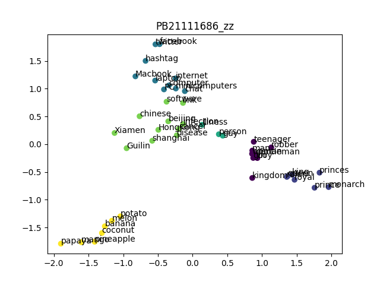

# AI_Lab_02
## PB21111686_赵卓
### Part_1
#### DecisionTree
- 实验背景：全球肥胖患病率在稳步上升，肥胖会导致身体和精神问题，是一个后果严重的全球性健康问题。现在我们有一份数据集，记录了来自秘鲁、墨西哥、哥伦比亚等国个人肥胖水平、饮食习惯和身体状况，包含了每个人的17个属性特征以及给定的肥胖等级分类（总共有7种）。现在我们要根据这份数据集构建决策树进行肥胖等级分类。
<br>

- 实验原理：
  - 决策树：
    - 决策树思想：在我们进行人为分类时，通常的思路是用某种特征属性作为分类的标准，比如西瓜的好坏，有经验的瓜农可以根据花纹的颜色来判断西瓜是好是坏，如果颜色深，瓜农认为是好瓜，如果颜色浅，瓜农认为是坏瓜。这样简单通过一个特征进行分类的结果不一定可信，但是我们将这种思路推广开，如果通过多个特征和多次分类，可以大大提高判断结果的准确率。决策树的思想正是来源于此，我们将多次分类的过程抽象为在树结构上的多次寻找子结点，直到寻找到叶结点，将该样本划分为这个叶结点的类别。
    - 决策树构建：我们可以递归构建决策树，每个结点都有其记录样本和子结点判断属性，叶结点还有划分类别。这样我们从根结点开始，依次递归构建每个子结点，每个子结点选择对应的属性值进行划分，完成决策树构建。
  - 划分属性的选择：
    - 信息熵：信息熵是一组不同分类的样本的数据一致程度，如果信息熵越小，数据一致性越高，否则越小。我们可以根据 $Ent=-\sum_{i=0}^kp_ilog_2p_i$ 来计算一组样本的信息熵，其中 $p_i$ 是第 $i$ 类在样本中出现的概率也即占比。
    - 信息增益：在决策树的构建过程中，对于每个子结点，我们并没有考虑如何选择最佳的属性值进行分类。我们可以通过信息增益来衡量不同属性的分类效果，信息增益是指将原样本划分为不同样本之后信息熵的减少值，信息增益 $\delta=Ent-\sum_{i=0}^k\frac{D_i}{D}Ent_i$ ，即原信息熵减去分类后的加权平均熵。因此我们可以计算出不同属性分类的信息增益，选择当前最大信息增益的属性进行分类。
  - 连续和离散值：
    - 不同属性有连续取值和离散取值两种情况，对这两种情况我们的划分方法也是不同的。
    - 离散取值：如果当前选择属性的取值是离散的，那么直接将每个取值作为一个分类，有几个分类就有几个子结点进行选择。
    - 连续取值：对于连续取值，我们将样本的取值集合升序排列，然后计算每两个相邻样本的平均值作为候选划分值。然后根据每个候选划分值将原样本划分为两部分，计算其信息增益。然后从候选划分值中选出信息增益最大的值，以此进行划分。事实上，对于离散或者连续取值都可以按照这个方法进行处理，相比于离散取值的每个取值一个分类能取得更好的效果，在本次实验中，我们也正是这样处理的。
<br>

- 实验过程：
  - Node 类的定义：
    框架并没有给出决策树每个结点的定义。对于每个叶结点，应该具有 feature_index ，即这个叶结点对应判别特征的索引。还要有判别值 threshold 作为判别依据。还要有 value ，即这个结点所属的类别，对于非叶结点，value 默认为-1。除此之外，还应该有 child 子结点数组。据此，得到以下定义：
    ```python
    # 叶结点
    class Node:
      def __init__(self, feature_index=None, threshold=-1, value=-1):
          self.feature_index = feature_index
          self.threshold = threshold
          self.value = value
          self.child = []
    ```
  - 计算信息熵：
    对于给定的 y 集合，我们要计算出其信息熵，统计出每个 y 值的概率，然后根据上面给出的公式计算即可。
    ```python
    # 计算信息熵  
    def get_ent(self, y):
        y_unique = np.unique(y)
        count_array = np.zeros(np.max(y_unique)+1)
        for k in y:
            count_array[k] = count_array[k] + 1
        all_counts = len(y)
        if all_counts == 0 or len(y_unique) == 1:
            return 0
        else:
            for i in y_unique:
                count_array[i] = count_array[i] / all_counts
            ent = 0
            for i in range(len(count_array)):
                if count_array[i] > 0:
                    ent = ent - count_array[i]*np.log2(count_array[i])
            return ent
    ```
  - 寻找最佳分割属性：
    正如我们在决策树连续取值最优分割中描述的，对于离散取值和连续取值，我们都采取这种方法进行寻找最佳分割。对于每个属性 col ，计算其可能分割值 sample_decide ，然后根据每个分割值对 y 分割得到 choose_y 和 remain_y ，计算其信息收益，然后选取最大的信息收益对应的 sample_decide 值作为 col 的 threshold 值，并记录 对应的 ent 值。然后从所有的 ent 中选择最大 ent 对应的属性 col ，根据这个 col 属性和对应的 threshold 构造子结点返回。代码如下：
    ```python
    def find_best_spilt(self, X, y):
        ent_D = self.get_ent(y)
        sample_count = len(y)
        threshold = np.zeros(len(X.columns))
        ent = np.zeros(len(X.columns))
        current = 0
        for col in X.columns : 
            sample_col = X[col]
            sample_unique = np.unique(sample_col)
            if len(sample_unique) > 1:
                sample_decide = np.zeros(len(sample_unique)-1)
                for i in range(len(sample_unique)-1) :
                    sample_decide[i] = (sample_unique[i] + sample_unique[i+1])/2 
                record_ent = np.zeros(len(sample_decide))
                for i in range(len(sample_decide)) : 
                    choose_indices = X[col] < sample_decide[i]
                    choose_y = y[choose_indices]
                    remain_y = y[~choose_indices]
                    choose_y_len = len(choose_y)
                    remain_y_len = len(remain_y)
                    choose_y_ent = self.get_ent(choose_y)
                    remain_y_ent = self.get_ent(remain_y)
                    current_ent = (choose_y_len * choose_y_ent + 
                                   remain_y_len * remain_y_ent) / sample_count
                    add_ent = ent_D - current_ent
                    record_ent[i] = add_ent
                max_index = np.argmax(record_ent)
                threshold[current] = sample_decide[max_index]
                ent[current] = record_ent[max_index]
            current = current + 1
        max_index = np.argmax(ent)
        max_threshold = threshold[max_index]
        return Node(feature_index=X.columns[max_index],threshold=max_threshold)
    ```
  - 决策树的构建：
    有了最佳分割函数，我们构造决策树只需要简单递归构造即可。输入 X 和 y 作为数据集，如果 y 只有一个取值，说明分类达到了目标，直接返回 value = y 的 Node 结点。否则调用 find_best_spilt 函数得到当前最佳结点，然后递归调用 build_tree 函数构建左右子结点即可。代码如下： 
    ```python
    def build_tree(self, X, y):
        now_class = np.unique(y)
        counts = np.bincount(y)
        max_index = np.argmax(counts)
        # 如果当前y只有一种说明分类成功
        if len(now_class) == 1 :
            return Node(value=now_class[0])
        else :
            current_node = self.find_best_spilt(X, y)
            choose_indices = X[current_node.feature_index] < current_node.threshold
            choose_X = X[choose_indices]
            remain_X = X[~choose_indices]
            choose_y = y[choose_indices]
            remain_y = y[~choose_indices]
            if len(choose_X) <= 0 :
                current_node.child.append(Node(value=max_index))
            else:
                current_node.child.append(self.build_tree(choose_X,choose_y))
            if len(remain_X) <= 0:
                current_node.child.append(Node(value=max_index))
            else:
                current_node.child.append(self.build_tree(remain_X,remain_y))
            return current_node
    ```
  - 测试集的预测：
    对于每个测试样例 sample ，递归遍历决策树即可，如果 sample 在当前 node.feature_index 值小于 node.threshold 值，那么就应该访问左结点，否则访问右结点，直到访问到叶结点返回叶结点的 value 值作为分类。代码如下：
    ```python
    # 递归遍历决策树
    def get_decision(self, node, sample):
        if node.value == -1:
            if sample[node.feature_index] > node.threshold : 
                return self.get_decision(node.child[1], sample)
            else :
                return self.get_decision(node.child[0], sample)
        else :
            return node.value
    ```
<br>

- 实验结果：
  我们运行代码，输出结果，达到了高达0.9598108747044918的正确率，如图所示：
    
<br>

#### PCAKMeans
- 实验背景：现在有一定数量的单词，以及根据这些单词训练好的高维度词向量，我们需要将其从高维降低到二维，然后对其进行分类，观察不同单词之间语义关系和在二维散点图上的距离之间的关系。
<br>
- 实验原理：
  - PCA：
    - 算法思想：在我们进行聚类分析时，如果向量的维度较低，可以直接处理。但是现实情况通常是我们有多个属性值，向量的维度很高，这个时候直接进行聚类分析不可行。面对“维度灾难”，PCA算法巧妙地采用降维的思想，将高维向量投影到低维，用投影后的点进行聚类。
    - 算法实现：首先计算出所有原向量的均值向量，然后将每个向量中心化，即将每个向量减去均值向量。然后计算处理后的向量集的协方差矩阵，并对协方差矩阵进行特征值分解，得到特征值和特征向量。对于我们需要的维度 d ，我们取前 d 大的特征值对应的特征向量组成投影矩阵。将此投影矩阵与原向量相乘即可降维得到 d 维向量。
  - KMeans：
    - 算法思想：普通聚类算法准确率偏低，为了解决这个问题，KMeans 采用动态聚类的思想。每次迭代更新每个聚类的中心重新聚类，直到聚类中心不变，通过这种迭代降低错误率。
    - 算法实现：首先规定聚类个数 K ，并随机选取 K 个点作为初始聚类中心。然后开始迭代，每个点选择最近的一个中心作为其聚类，完成一轮聚类后，计算每个聚类的均值点作为新的中心开始下一轮迭代。
<br>

- 实验过程：
  - 核函数的实现：
    在 PCA 中可以通过核函数进行转换，然后降维。主要核函数有线性核函数、多项式核函数、径向基核函数，在本次实验中我们实现了这几个核函数，但是根据实验文档给出的 PCA 计算步骤，并没有使用核函数。代码如下：
    ```python
    # index是次数
    def get_kernel_function(kernel:str, index = 2):
    # 线性核，计算两个向量的点积dot
    if kernel == "linear":
        return lambda x, y: np.dot(x, y)
    # 多项式核，先取点积再加指数，这里默认2次
    elif kernel == "polynomial":
        return lambda x, y: (np.dot(x, y) + 1)**index  
    # 径向基函数核，非线性
    elif kernel == "rbf":
        def rbf_kernel(x, y, gamma=0.05):
            return np.exp(-gamma * np.linalg.norm(x - y) ** 2)
        return rbf_kernel
    else:
        return None
    ```
  - PCA.fit 函数实现：
    fit 函数计算特征向量，即降维矩阵。根据文档给出的步骤：调用 np.mean 库函数计算 X 的均值向量 self.mean ，用 X 减去 self.mean 得到中心矩阵，用 np.cov 库函数计算中心矩阵的协方差矩阵，用 np.linalg.eig 库函数计算协方差矩阵的特征值和特征向量，对特征值用 np.argsort 库函数升序排序，再取后两个特征值对应的特征向量，就得到了降维矩阵。代码如下：
    ```python
    def fit(self, X:np.ndarray):
    # 根据文档给出的步骤：
    # 计算平均值，axis表示沿着行方向进行操作，即计算每列的平均值
    self.mean = np.mean(X, axis=0)
    # 计算中心矩阵
    X_center = X - self.mean
    # 计算协方差矩阵
    cov_matrix = np.cov(X_center, rowvar=False)
    # 计算特征值和特征向量
    special_values, special_vectors = np.linalg.eig(cov_matrix)
    # 对特征值进行升序排序
    sort_index = np.argsort(special_values)
    # 取特征值前二的特征向量，即倒数后两个，因为升序
    self.sepcial_matrix = special_vectors[:, sort_index[:-self.n_components-1:-1]]
    return self
    ```
  - transform 函数实现：
    transform 函数将原样本 X 降维为二维向量，只需要调用 np.dot 库函数进行矩阵乘法即可。代码如下：
    ```python
    def transform(self, X:np.ndarray):
    # 进行矩阵乘法降维
    X_center = X - self.mean
    return np.dot(X_center, self.sepcial_matrix)
    ```
  
  - initialize_centers 函数实现：
    initialize_centers 初始化聚类的中心，我们调用 np.random.choice 库函数，从样本中不重复随机抽样10个，然后对其取均值得到中心，记录在 points 数组中。代码如下：
    ```python 
    # 初始化中心
    def initialize_centers(self, points):
        sample_count, div = points.shape
        self.centers = np.zeros((self.n_clusters, div))
        for i in range(self.n_clusters):
            # 从样本的下标中随机抽样，抽取10个，不可重复
            random_index = np.random.choice(sample_count, size=10, replace=False)
            # 将抽取的10个样本取均值，作为中心
            self.centers[i] = points[random_index].mean(axis=0)
        return self.centers
    ```
  - assign_points 函数实现：
    assign_points 对每个样本根据 points 中的中心点进行分类。遍历每个样本，然后遍历每个中心，计算到每个中心的欧氏距离，选择欧式距离最小的中心划分，将对应中心记录在 labels 数组里面。代码如下：
    ```python
    # 对每个样本进行划分
    def assign_points(self, points):
        point_count = points.shape[0]
        center_count = self.centers.shape[0]
        # 初始化标签
        self.labels = np.zeros(point_count, dtype=int)  
        # 遍历每个点的下标
        for i in range(point_count):  
            # 初始化最近距离和最近中心
            min_distance = float('inf')  
            closest_center = -1  
            # 遍历每个中心
            for j in range(center_count):  
                # 计算欧式距离
                distance = np.sqrt(((points[i] - self.centers[j])**2).sum()) 
                if distance < min_distance:
                    # 更新最近点
                    min_distance = distance
                    closest_center = j
            # 将最近的中心索引赋值给当前点的标签
            self.labels[i] = closest_center  
        return self.labels
    ```
  - update_points 函数实现：
    更新中心点较为简单，将每个簇的点取平均即可成为新中心点。代码如下：
    ```python
     # 更新中心点
    def update_centers(self, points):
        # 将每个簇的点取平均得到新中心点
        for i in range(self.n_clusters):
            self.centers[i] = np.mean(points[self.labels == i], axis=0)
    ```
  - KMeans.fit 函数实现：
    fit 函数进行 KMeans 的迭代，initialize_centers 之后，assign_points 然后 update_centers ，直到更新前后中心相同。代码如下：
    ```python
    # 迭代更新
    def fit(self, points):
        self.initialize_centers(points)
        for _ in range(self.max_iter):
            self.assign_points(points)
            # 保留之前的中心
            before_centers = self.centers.copy()
            # 更新中心
            self.update_centers(points)
            # 如果之前的中心和现在的中心完全一样，停止KMeans
            if np.all(before_centers == self.centers):
                break
        return self
    ```
  <br>

- 实验结果：
  我们将经过 PCA 降维和 KMeans 聚类的数据用散点图展示出来，相同颜色表示相同分类，结果非常符合预期：
  
<br>

### Part_2
#### 深度学习
- 实验架构：
  - MoE（Mixture of Experts）：MoE是一种模型架构，旨在通过组合多个专家模型来提高整体模型的性能。其核心思想是将模型分成多个子模型（专家），每个专家负责处理数据的不同部分或不同方面。其架构通常由两部分组成，一个是Router（路由器），负责根据输入数据将特定部分分配给不同的专家；另一个是专家网络，即实际处理数据的多个子模型。
  - Transformer：Transformer是一种革命性的神经网络架构。它首次引入了注意力机制的全局性使用，取代了传统的循环神经网络（RNN）结构。Transformer由编码器和解码器构成，每个部分都包含多个注意力头（Multi-Head Attention）和全连接层。通过注意力机制，Transformer能够并行处理输入序列中的不同位置信息，极大提高了处理长距离依赖性的能力。
  - Sparse MoE Layer：Sparse MoE Layer是对传统MoE的改进，旨在减少计算和存储成本。传统MoE中，每个输入都分配给所有专家，而Sparse MoE Layer通过使用稀疏选择机制，仅选择少数专家来处理特定的输入。在大规模数据和模型中，Sparse MoE Layer能够更高效地利用计算资源，并保持模型性能。
  - Router：Router是MoE中负责分配输入数据给不同专家的组件，根据输入数据的特征向量，通过学习的方式动态地将输入数据路由给适合的专家。
  - Multi-Head Attention：Multi-Head Attention 是 Transformer 架构中的核心组件之一，用于捕捉输入序列中不同位置的关系和依赖关系。它允许模型同时关注输入序列的不同部分，通过多个注意力头并行计算不同的注意力表示，每个注意力头独立地学习注意力权重，然后通过加权平均或拼接等方式整合不同头的输出。
<br>

- 实验过程：
  - 数据预处理与Tokenizer
    我们实现了一个简单的Tokenizer类来处理文本数据。Tokenizer负责将文本转换为模型可接受的编码序列，并且支持解码回文本。实现代码如下：
    ```python
    class Tokenizer:
    def __init__(self, dataPath:str):
        with open(dataPath,"r",encoding="utf-8") as f:
            self.dataset = f.read()
        self.generate_vocabulary()
    
    # 产生符号表
    def generate_vocabulary(self, ):
        self.char2index = {}
        self.index2char = {}

        # 添加开始和结束符号
        self.char2index["<START>"] = 0
        self.char2index["<END>"] = 1
        self.index2char[0] = "<START>"
        self.index2char[1] = "<END>"

        # 对数据集中的每个字符都标号，从2开始
        index = 2 
        for char in sorted(set(self.dataset)):
            if char not in self.char2index:
                self.char2index[char] = index
                self.index2char[index] = char
                index += 1

    # 对数据集进行编码
    def encode(self, sentence : str) -> torch.Tensor:
        # 添加开始符号
        tokenflow = [self.char2index["<START>"]]
        # 对于输入句子的每个字符，依次编号添加到tokens中
        # 如果有不在符号表中的字符，用终结符替代
        for char in sentence:
            tokenflow.append(self.char2index.get(char, self.char2index["<END>"]))  
        # 添加终结符号
        tokenflow.append(self.char2index["<END>"])
        # 以Tensor形式返回  
        return torch.tensor(tokenflow, dtype=torch.long)
    
    # 编码后进行解码
    def decode(self, tokens : torch.Tensor) -> str:
        # 转换为list
        if isinstance(tokens, torch.Tensor):
            tokens = tokens.tolist()
        # 解码为字符流
        charflow = []
        for token in tokens:
            # 未知编码返回<UNK>即Unknown
            char = self.index2char.get(token, "<UNK>")
            if char not in ["<START>", "<END>"]:
                charflow.append(char)
        # 连接成字符串返回
        return "".join(charflow)
    ```

  - 数据集与数据加载器
    我们定义了 ShakespeareDataset 类和 create_dataloader 函数用于处理文本数据集和创建数据加载器。数据集按照指定的 chunk_size 进行切分，并在训练和验证集之间进行划分。实现代码如下：
    ```python
    class ShakespeareDataset(Dataset):
    def __init__(self, filepath, tokenizer, chunk_size):
        self.tokenizer = tokenizer
        with open(filepath, 'r', encoding='utf-8') as file:
            text = file.read()
        self.encoded = self.tokenizer.encode(text)
        self.chunk_size = chunk_size

    def __len__(self):
        return len(self.encoded) - self.chunk_size

    def __getitem__(self, idx):
        # 提取文本，文本作为输入，每个字符的下一个字符作为标签（size+1）
        chunk = self.encoded[idx: idx + self.chunk_size]
        label = self.encoded[idx + 1: idx + self.chunk_size + 1]
        return chunk, label

    tokenizer = Tokenizer(dataPath="input.txt")

    def create_dataloader(filepath, tokenizer, chunk_size, batch_size, shuffle=True):
        dataset = ShakespeareDataset(filepath, tokenizer, chunk_size)
        train_dataset,val_dataset = torch.utils.data.random_split
        (dataset,[int(len(dataset)*0.8),len(dataset)-int(len(dataset)*0.8)])
        train_dataloader = DataLoader(train_dataset, batch_size=batch_size, shuffle=shuffle)
        val_dataloader = DataLoader(val_dataset, batch_size=batch_size, shuffle=shuffle)
        return train_dataloader, val_dataloader

    train_dataloader,val_dataloader = create_dataloader('input.txt', 
                                                        tokenizer, chunk_size=200, batch_size=2)
    ```
  
  - 模型组件：Multi-Head Attention, Expert, TopkRouter, SparseMoE
    我们实现了Transformer模型所需的几个关键组件：Multi-Head Attention: 多头注意力机制用于提取输入序列中的信息；Expert: 专家网络，用于处理稀疏多专家模块中每个专家的计算；TopkRouter: 用于选择稀疏多专家模块中的顶部K个专家；SparseMoE: 稀疏多专家模块，结合了TopkRouter和多个Expert，以增强模型的表达能力。
    ```python
    class MultiHeadAttention(nn.Module):
        def __init__(self, n_heads:int, head_size:int, seq_len:int, embed_size:int):
            super().__init__()
            self.n_heads = n_heads
            # 计算头的大小
            self.head_size = embed_size // n_heads  
            # 确保整除，分割正确
            assert embed_size % n_heads == 0, "attention:embed_size should divide n_heads!"
            # 建立多头注意力层
            self.heads = nn.ModuleList([HeadAttention(seq_len, embed_size, 
            self.head_size) for _ in range(n_heads)])
            self.projection = nn.Linear(embed_size, embed_size)


        def forward(self, inputs):
            batch_size, seq_len, embed_size = inputs.shape
            # 确保匹配
            assert embed_size == self.n_heads * self.head_size, 
            "embed_size must be equal to n_heads * head_size"
            # 计算每个头的输出
            outputs = [head(inputs) for head in self.heads] 
            # 链接所有的头输出
            connect_output = torch.cat(outputs, dim=-1) 
            # 回到最初的大小
            output = self.projection(connect_output)  
            return output  
    
    # 专家层
    class Expert(nn.Module):
        def __init__(self, embed_size: int):
            super().__init__()
            # 初始化两个线性层
            self.fc1 = nn.Linear(embed_size, 4 * embed_size)
            self.fc2 = nn.Linear(4 * embed_size, embed_size)

        def forward(self, inputs):
            swap = self.fc1(inputs) 
            # 实施非线性激活
            swap = F.relu(swap) 
            outputs = self.fc2(swap) 
            return outputs
    

    class TopkRouter(nn.Module):
        def __init__(self, embed_size, num_experts, active_experts):
            super().__init__()
            self.num_experts = num_experts
            self.active_experts = active_experts
            # 对专家层进行线性变换
            self.router_weights = nn.Linear(embed_size, num_experts)
        
        def forward(self, inputs):
            batch_size, seq_len, embed_size = inputs.shape
            # 为每个token计算logits
            logits = self.router_weights(inputs)
            # 实施softmax得到常规化结果
            router_output = F.softmax(logits, dim=-1) 
            # 对于每个词token，选定前k个有最高权重的专家层
            topk_values, indices = torch.topk(router_output, self.active_experts, dim=-1)
            # 常规化选定的专家层
            topk_normalized = topk_values / topk_values.sum(dim=-1, keepdim=True)
            return topk_normalized, indices

    class SparseMoE(nn.Module):
        def __init__(self, embed_size: int, num_experts: int, active_experts: int):
            super().__init__()
            self.num_experts = num_experts
            self.active_experts = active_experts
            # 初始化router
            self.router = TopkRouter(embed_size, num_experts, active_experts)
            # 初始化专家层
            self.experts = nn.ModuleList([Expert(embed_size) for _ in range(num_experts)])

        def forward(self, inputs):
            batch_size, seq_len, embed_size = inputs.shape
            router_output, indices = self.router(inputs)
            # 最终输出
            final_output = torch.zeros_like(inputs)

            for i in range(self.active_experts):
                expert_idx = indices[:, :, i]
                # 准备掩码
                mask = torch.zeros(batch_size, seq_len, self.num_experts, device=inputs.device)
                mask.scatter_(2, expert_idx.unsqueeze(-1), 1)
                # 从现在的专家收集输入
                selected_inputs = inputs.unsqueeze(2) * mask.unsqueeze(-1)
                selected_inputs = selected_inputs.sum(dim=2) 
                # 对选定的输入实施专家层
                expert_output = self.experts[i](selected_inputs)  
                # 计算输出
                final_output += expert_output * router_output[:, :, i].unsqueeze(-1) 
            return final_output
    ```
  
  - Transformer Block
    Transformer Block结合了多头注意力机制、稀疏多专家模块和前馈神经网络。此外，还包括Layer Normalization层以及Add & Norm操作。
    ```python
    class Block(nn.Module):
    def __init__(self, embed_size: int, n_heads: int, seq_len: int, 
    num_experts: int, active_experts: int):
        super().__init__()
        # 多头注意层
        self.attention = MultiHeadAttention(n_heads, embed_size // n_heads, seq_len, embed_size)
        # SparseMoE
        self.sparse_moe = SparseMoE(embed_size, num_experts, active_experts)
        # 前馈层
        self.feed_forward = nn.Sequential(nn.Linear(embed_size, 4 * embed_size), 
        nn.ReLU(), nn.Linear(4 * embed_size, embed_size))
        # 常规化层
        self.ln1 = nn.LayerNorm(embed_size)
        self.ln2 = nn.LayerNorm(embed_size)
        self.ln3 = nn.LayerNorm(embed_size)

    def forward(self, inputs):
        # 多头注意力
        attn_output = self.attention(inputs)
        attn_output = self.ln1(inputs + attn_output) 
        # SparseMoE
        moe_output = self.sparse_moe(attn_output)
        moe_output = self.ln2(attn_output + moe_output)
        # 前馈层
        ff_output = self.feed_forward(moe_output)
        output = self.ln3(moe_output + ff_output) 

        return output
    ```
  
  - SparseMoETransformer模型
    SparseMoETransformer模型整合了多个Transformer Block，并添加了Token Embedding、Positional Encoding、Layer Normalization和输出线性层。实现代码如下：
    ```python
    class SparseMoETransformer(nn.Module):
    def __init__(self, vocab_size:int, seq_len:int, embed_size:int,
        n_layers:int, n_heads:int, num_experts:int, active_experts:int):
        super().__init__()

        self.seq_len = seq_len
        self.embed_size = embed_size
        # 词汇嵌入、位置编码
        self.token_embedding = nn.Embedding(vocab_size, embed_size)
        self.position_embedding = nn.Embedding(seq_len, embed_size)
        # Transformer块
        self.blocks = nn.ModuleList([Block(embed_size, n_heads, 
        seq_len, num_experts, active_experts) for _ in range(n_layers)])
        # 层常规化并且输出
        self.layer_norm = nn.LayerNorm(embed_size)
        self.output_layer = nn.Linear(embed_size, vocab_size)

    def forward(self, inputs, labels=None):
        batch_size, seq_len = inputs.shape
        # 为每个位置创建id
        position_ids = torch.arange(seq_len, device=inputs.device).unsqueeze(0).expand(batch_size, -1)
        # 嵌入
        token_embeddings = self.token_embedding(inputs)
        position_embeddings = self.position_embedding(position_ids)  
        embeddings = token_embeddings + position_embeddings  
        # 从Transfromer块传过去
        x = embeddings
        for block in self.blocks:
            x = block(x)
        x = self.layer_norm(x)
        logits = self.output_layer(x)
        # 如果有标签，计算损失
        if labels is None:
            loss = None
        else:
            loss = F.cross_entropy(logits.view(-1, logits.size(-1)), labels.view(-1))
        return logits, loss
    


    def generate(self, inputs, max_new_tokens):
        encoded_input = tokenizer.encode(inputs)
        encoded_input = torch.tensor(encoded_input).unsqueeze(0) 
        device = next(self.parameters()).device  
        encoded_input = encoded_input.to(device)

        if encoded_input.size(1) > self.seq_len:
            encoded_input = encoded_input[:, :self.seq_len]

        generated = encoded_input
        for _ in range(max_new_tokens):
            if generated.size(1) > self.seq_len:
                generated_input = generated[:, -self.seq_len:]
            else:
                generated_input = generated

            logits, _ = self.forward(generated_input)
            last_logits = logits[:, -1, :]
            next_token_ids = torch.argmax(last_logits, dim=-1)
            next_token_ids = next_token_ids.unsqueeze(-1)
            generated = torch.cat([generated, next_token_ids], dim=1)

        generated_ids = generated[0].tolist()
        generated_text = tokenizer.decode(generated_ids)
        return generated_text
    ```
  
  - 训练与验证
    我们定义了train函数和validate函数来训练和验证模型。在每个epoch内，计算损失并更新模型参数。实现代码如下：
    ```python
    def train(model, dataloader, epoch, device):
        optimizer = torch.optim.Adam(model.parameters(), lr=0.001)
        model.train()
        total_loss = 0
        for i, (inputs, targets) in tqdm(enumerate(dataloader), total=len(dataloader)):
            inputs, targets = inputs.to(device), targets.to(device)
            optimizer.zero_grad()
            logits, loss = model(inputs, targets)
            loss.backward()
            optimizer.step()
            total_loss += loss.item()
        print(f'Epoch {epoch} Loss: {total_loss / len(dataloader)}')
        return total_loss / len(dataloader)

    def validate(model, dataloader, epoch, device):
        model.eval()
        total_loss = 0
        with torch.no_grad():
            for i, (inputs, targets) in tqdm(enumerate(dataloader), total=len(dataloader)):
                inputs, targets = inputs.to(device), targets.to(device)
                logits, loss = model(inputs, targets)
                total_loss += loss.item()
        print(f'Epoch {epoch} Validation Loss: {total_loss / len(dataloader)}')
        return total_loss / len(dataloader)
    ```
  
  - 模型训练与生成
    最后，实现了一个run函数来组织模型的训练过程，并调用模型的generate方法生成文本。实现代码如下：
    ```python
    # 训练模型
    def run(model, train_dataloader, valid_dataloader, device, epochs=10):
        train_losses = []
        valid_losses = []
        for epoch in range(epochs):
            train_loss = train(model, train_dataloader, epoch, device)
            valid_loss = validate(model, valid_dataloader, epoch, device)
            train_losses.append(train_loss)
            valid_losses.append(valid_loss)
            print(f'Epoch {epoch} Train Loss: {train_loss}, Valid Loss: {valid_loss}')

        # 绘图输出损失
        plt.figure(figsize=(10, 5))
        plt.plot(range(epochs), train_losses, label='Train Loss')
        plt.plot(range(epochs), valid_losses, label='Validation Loss')
        plt.xlabel('Epoch')
        plt.ylabel('Loss')
        plt.title('Training and Validation Loss Over Epochs')
        plt.legend()
        plt.show()
    ```


- 实验结果：
  - 我们采用 epochs = 5,10,20 分别使用 Colab 的 GPU 训练模型，并以下面五个句子作为开头测试文本生成：
  ```python
  # 测试生成文本，最多300词，选择五个句子进行测试
  generated_text = model.generate("I have a dog.", tokenizer=tokenizer,max_new_tokens=300)
  print(generated_text)

  generated_text = model.generate("You are so fool!", tokenizer=tokenizer,max_new_tokens=300)
  print(generated_text)

  generated_text = model.generate("Where is the God?", tokenizer=tokenizer,max_new_tokens=300)
  print(generated_text)

  generated_text = model.generate("How are you?", tokenizer=tokenizer,max_new_tokens=300)
  print(generated_text)

  generated_text = model.generate("Please tell me the truth", tokenizer=tokenizer,max_new_tokens=300)
  print(generated_text)
  ```
  - 测试结果如下：
    - epochs = 5 ：
      - loss 曲线
        
      - 生成结果：
        
        
    - epochs = 10 ：
      - loss 曲线：
        
      - 生成结果：
        
    - epochs = 20 ：
      - loss 曲线：
        
      - 生成结果：
        
        
  - 由于训练时间限制，我们没有进行更多轮次的训练，但是从上面的训练结果对比可以看出，当训练轮次增多时，效果逐渐变好，还没有出现过拟合现象，这是因为训练轮次都偏少的原因。尽管如此，loss 也控制在 1.x 左右，且输出的文本很少出现不可识别的单词。总体来说，模型取得了较好的表现效果。（提交训练 20 epochs 的 model.pth）

### Bonus
- 实验思想：本实验利用生成式预训练模型和梯度攻击生成器，通过迭代优化输入前缀，使得模型生成的文本中包含特定的目标字符串。我们使用了 TinyStories-33M 模型来生成文本。梯度攻击生成器的核心思想是计算目标字符串与当前生成文本的差异，然后利用梯度信息调整输入前缀，逐步接近目标。
<br>

- 实验过程：
  - 初始化
    首先导入所需的库和模型，然后设置随机种子和设备（GPU），以确保结果的可重现性和利用GPU加速计算。
  - 模型和tokenizer
    使用 AutoModelForCausalLM 和 AutoTokenizer 初始化预训练的 TinyStories-33M 模型和 GPT-Neo-125M 的tokenizer。
将模型移动到GPU上进行计算，并设置为评估模式。
  - 梯度攻击生成器
    token_gradients 函数: 计算指定输入前缀和目标字符串之间的梯度。这里使用了CrossEntropyLoss作为损失函数，根据输入前缀和模型生成的logits计算梯度；
    sample_control 函数: 根据梯度信息采样新的控制标记（token），用于更新输入前缀，增加探索性；get_filtered_cands 函数: 过滤并获取符合条件的候选生成文本，用于评估生成结果的质量和更新输入前缀。
   - 模型操作
     get_logits 函数: 根据给定的输入前缀和控制标记，生成模型输出的logits。支持返回logits和token IDs用于损失计算；forward 函数: 执行模型的前向传播，生成输出logits。
   
   - 损失函数
     target_loss 函数: 计算模型输出logits与目标字符串之间的损失。采用交叉熵损失函数（CrossEntropyLoss）来评估模型输出与目标之间的差异。
    
   - 迭代优化过程
    主循环: 通过多次迭代优化输入前缀，使得生成的文本中包含特定的目标字符串；每次迭代中，计算当前输入前缀的梯度，更新输入前缀，计算生成文本与目标的损失，并根据损失选择最佳的新输入前缀；使用动态绘图工具 livelossplot 实时监测损失变化；当生成的文本中包含目标字符串时，终止优化过程。

   - 成功检测
     is_success 函数: 判断生成的文本是否包含目标字符串，如果包含则返回True。
<br>

- 实验结果：
  - 以 'What can I say?Manba out!' 为 target ，结果如下：
    ```
    What can I say?
    Togtonrey was a very busy mail carrier!

    What can I say?
    Togtonrey was a very busy mail carrier!

    SUCCESS:  pilot!!!!!!!! carried ear builder showing!!!!!!!! 
    Waiturned VolcanoMail!!!!!!!!sfolk give injured!!!!!!!!!!!!
    !!!!!!!!!!!!cake!!!!!!!! Bin!!!!!!!!ick Helen
    ```
    loss 如下：
    
   
   - 以 'See you again.' 为target ，结果如下：
     ```
     The attention mask and the pad token id were not set. As a consequence, 
      you may observe unexpected behavior. Please pass your input's `attention_mask` 
      to obtain reliable results.
      Setting `pad_token_id` to `eos_token_id`:50256 for open-end generation.
      See you again.”

      Stososie had a great day at the park and couldn’t wait to go again.

      See you again.”

      Stososie had a great day at the park and couldn’t wait to go again.

      SUCCESS: Levannie!!!!!!!!!!!!!!!!!!!!!!!!!!!!!!!!!!!!!!!!!!!!!!!!!!!!
      !!!!!!!!!!!!!!!!!!!!!!!!!!!!!!!!!!!!!!!!!!!!!!!!!!!! parents!!!!!!!
      !ugs Band!!!!!!!! cu!!!!!!!! discovering stationsrd
     ```
     loss 如下：
     
  

   